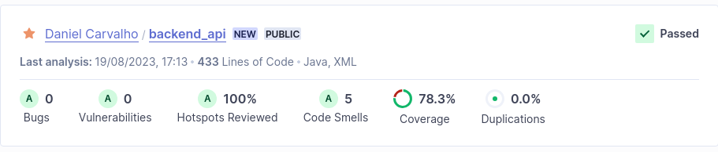
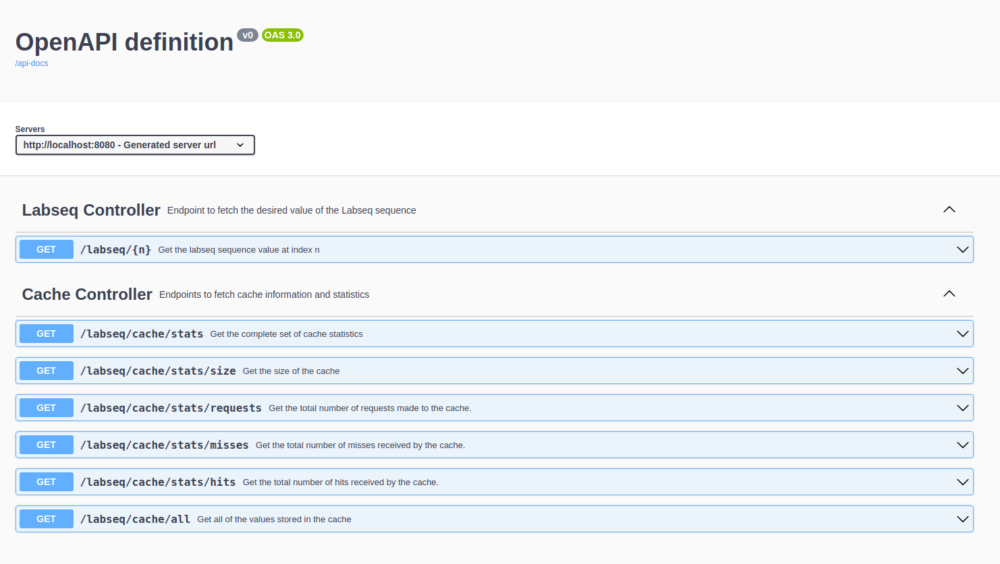
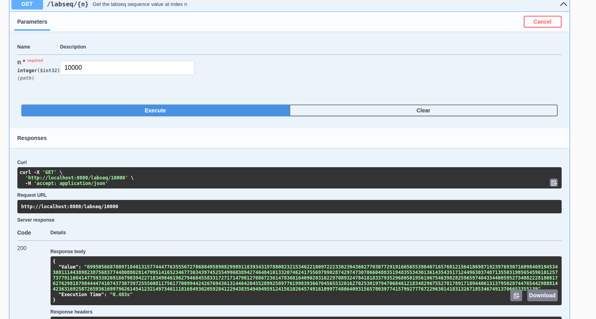

# Labseq API

In this project, a REST service was implemented to compute and return values from the labseq sequence, at a given index, passed as a parameter when the main endpoint of the API, labseq/{n}, is called. The service was developed using the Spring Boot Java framework.

## Table of contents
1. [How to Run](#how-to-run)
2. [Cache Implementation](#cache-implementation)
3. [Development Strategy](#development-strategy)
4. [Documentation](#documentation)
5. [Screenshots](#screenshots)

## How to Run

### Docker 

The REST service is deployed using Docker Compose. Thus to run, after having [installed Docker](https://docs.docker.com/engine/install/), the user only needs to run the following command on the main folder of the project:

```bash
$ docker-compose up
```

### Local

If the user wishes to run the Spring Boot project instead, after having installed Java's JDK 17 and Maven, the user needs to move to the backend_api folder, and run the project from there:

```bash
$ cd ./backend_api
$ mvn spring-boot:run
```
### Links

After the user has run the project, using either method, the REST API and the Swagger UI documentation are available in the following links:
- REST API at [http://localhost:8080](http://localhost:8080)
- Swagger UI documentation at [http://localhost:8080/swagger-ui/index.html](http://localhost:8080/swagger-ui/index.html)

## Cache Implementation

In order to take advantage of previous calculations, to speed up future calculations, a caching mechanism was implemented in the project. This cache was manually implemented, instead of using the Spring Cache Abstraction, in order to guarantee that the cache could be called to speed up intermediary operations as well, that is, calculating the values of l(n-4) and l(n-3) when fetching the value of l(n). Thus, it consists of a memoized HashMap holding as keys indexes of the Labseq sequence storing the corresponding sequence values. Given that the labseq sequence values don't change, the cache has no TTL defined.
The creation of this cache allowed the calculation of l(10000) at an execution time of less than 1s.

A REST Controller was created to access and check the cache and its statistics, such as the total size, number of requests, number of hits and number of misses.

## Development Strategy

The development of this project employed a Test-Driven Development strategy. Thus, development started with the creation of unit tests, with the aim of ensuring that the Labseq and Cache Services behaved as expected. These tests were also complemented with boundary tests of the REST controllers, to verify whether they endpoints consumed HTTP requests and returned responses as expected or not, as well as a integration test where the full context of the Spring Boot application was loaded.

A CI pipeline was also setup on this repository, allowing for the analysis of each push with a code static analysis inspector, Sonar Cloud, with the aim of ensuring code quality, security and test coverage. This code static analysis allowed to analyze and correct vulnerabilities, security hotspots, code smells, as well as to analyze the code coverage of the project, which stands at nearly 80%.

## Documentation

The REST API is documented in the Open API format, using Swagger and SpringDoc. 
The REST API documentation is available at [http://localhost:8080/swagger-ui/index.html](http://localhost:8080/swagger-ui/index.html) once the project is running.

## Screenshots

- Sonar Cloud code analysis for the project


- Swagger UI documentation page


- Calling the labseq/{n} endpoint with N=10000

